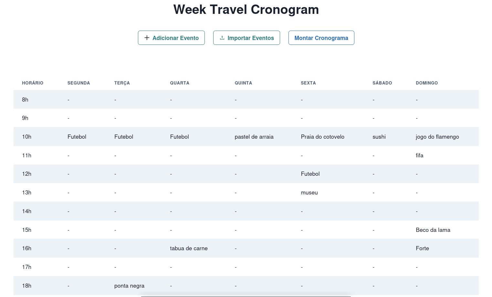

# NomedoProjeto

**Número da Lista**: 32 
**Conteúdo da Disciplina**: Greed 

## Alunos
|Matrícula | Aluno |
| -- | -- |
| 18/0149687  |  Daniel Porto de Souza |

## Sobre 
Essa plataforma visa resolver um grande problema de pessoas indecisas em suas viagens de férias: definir um cronograma dos eventos e passeios. Para tanto, a aplicação define automaticamenteum cronograma para a programação da viagem conforme a disponibilidade e a prioridade, podendo o usuário inserir uma lista de atividades estruturada ou eventos exporádicos informando o nome, o dia, o horário e a prioridade do evento.

## Screenshots

## Instalação 
**Linguagem**: Javascript 

### Pré-requisitos:
- Git
- npm

## Uso 
Para a utilização, basta clonar o repositório com:
> $ git clone https://github.com/projeto-de-algoritmos/Greed-Travel-Schedule

Feito a clone, dentro do diretório do repositório, basta executar o comando:

> $ npm start

Uma aba no seu navegador padrão deverá abrir. Casos não abra, basta acessar o localhost:3000

## Outros 

A funcionalidade de inserção dos eventos a partir de um arquivo utiliza arquivos de texto. Cada evento deve estar em uma linha diferente e sua descrição deve seguir o seguinte padrão:

**Nome do evento(20 chars):Dia da semana:Hora(8-22):prioridade(1-5)**

### Exemplo:

**Futebol:segunda:19:1**  
**Restaurante:terca:12:1** 
**Praia:sexta:14:1**

- A prioridade 1 é a mais alta

Qualquer evento que fuja desse padrão será ignorado

